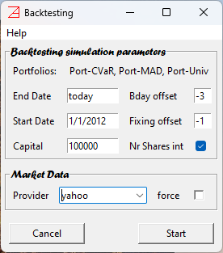
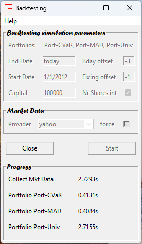

# Backtesting window #

Any backtesting request will open the `Backtesting` window to set the simulation parameters and to trigger the computations.

Here is an example,

Let us analyze each section.

## Backtesting simulation parameters ##

`Portfolios:` - list the portfolio names subject to the simulation. In our case they are `Port-CVaR`, `Port-MAD`, and `Port-Univ`.
There is no hard limit for how many portfolios can be subject to a single
simulation. However, our practice suggests that more than 10 are hard to analyze in a single batch. Using multiple batches, 
of no more than 10 portfolios,
and successively eliminating the weak candidates could be a better practical approach.

`End Date`: - is the simulation end date. 
Its default value, in our case `today`, is the value set in [`Application Settings/Miscellaneous/edate default value`](./Settings_Panel.md#miscellaneous). 
The actual simulation ends in the most recent exchange closing date relative to the `End Date`
(according to the exchange business calendar set in [`Application Settings/Miscellaneous/Exchange calendar`](./Settings_Panel.md#miscellaneous)).

`Start Date`: - is the start date of the historical market data present in the simulation. 
Its default value, in our case `1/1/2012`, is the value set in [`Application Settings/Miscellaneous/sdate default value`](./Settings_Panel.md#miscellaneous).
The actual simulation start date is
determined based on the underlining model needs for calibration. For example, an optimization based on mCVaR risk measure 
may require more than 1 year of historical data to calibrate the first portfolio reset date. The actual historical calibration period 
is a settable model parameter ([see](./mCVaR_inc.md)). 
Therefore, the simulation start date may be different for different portfolios (models). The application will search 
for the earliest possible simulation start date.

`Capital`: - is the initial cash capital.
Its default value, in our case `100000`, is the value set in [`Application Settings/Miscellaneous/Capital default value`](./Settings_Panel.md#miscellaneous).
In general, the capital should be much larger than the typical value of the most expensive share 
in the portfolio, such that the rounding effect to integer number of shares (residual cash rolled to next portfolio reset date) is not impactful.
Obviously, the capital value should also reflect a realistic user cash allocation.

`Bday offset`: - is the number of business days offset relative to the end of calendar period defining the rebalancing dates. 
Its default value, in our case `-3`, is the value set in [`Application Settings/Miscellaneous/noffset default value`](./Settings_Panel.md#miscellaneous).
This is a complex definition in need of clarification.  
Let us start by mentioning that each portfolio model contains a parameter `freq` defining the targeted return rate horizon. 
It can be set to `M`, for monthly, or `Q`, for quarterly. It implies that the portfolio has a reset frequency equal to `freq` value. 
The simulation sets the rebalancing dates relative to the end of each calendar month, if `freq=M`, or end of each calendar quarter, if `freq=Q`.
`Bday offset` defines the actual rebalancing date as an offset of business days relative to the end of these calendar periods. 
A negative value, say `-3`, implies that the actual rebalancing day is 3 business days prior to the end of calendar period (e.g., end of 
calendar quarter if `freq=Q`). A positive value, say `3`, defines the actual rebalancing day to be 3 business days post the end of calendar period. 
It is a general practice for financial institutions (hedge funds and banks) to have a performance report in the last 3 business days of the quarter (sometimes, month).
Therefore, the end of quarter (and to some extent, end of month) asset prices tend to be more dependable (on high market volumes). 
It may be a good practice to position the rebalancing dates in the last 3 business day of the calendar period (i.e., `0`, `-1`, `-2`, `-3`). 
However, it should also be a user realistic (friendly) date. For example, the end of the fourth calendar quarter is the last business day in December, a period of celebrations
for most people around the world. You may want to avoid it as a rebalancing date (i.e., set `Bday offset` to something else than `0`) 
unless you are determined to be focused in executing the necessary financial transactions just before the New Year Eve. 

`Fixing offset`: - is the offset in number of business days relative to the `Bday offset` defining the simulation fixing dates. 
Its default value, in our case `-1`, is the value set in [`Application Settings/Miscellaneous/fixoffset default value`](./Settings_Panel.md#miscellaneous).
While `Bday offset` defines the simulation rebalancing dates (the business day when the portfolio shares are both and sold), 
the `Fixing offset` defines the last business day present in the model calibration. 
Therefore, `Fixing offset` can take only negative values. 
Note that a value of `0` implies that you have access to real-time market data and able to perform the weights computation and buy/sale orders in the 
last minute of the trading day. In general, this is an unrealistic scenario for regular retail market participants. A value of `-1` is the most common
scenario (the portfolio is rebalance based on the weights computation including the most recent close prices).

`Nr Shares int`: - if checked, the numbers of shares are rounded to the nearest integer value and the residual cash is carried between rebalancing dates.
Left unchecked implies that positions with a fractional number of shares are permitted. 
There are brokers that allow fractional shares orders. Check the transaction fee schedule; it may be punitive. 
Its default value, in our case it is checked, is the value set in [`Application Settings/Miscellaneous/Int. nr. shares`](./Settings_Panel.md#miscellaneous).

## Market data ##

`Provider`: - drop down list of the available market data provider set in the [`Application Settings/Market Data/Market data provider`](./Settings_Panel.md#market-data)
default values.
We need to pick one, in our case it is `yahoo`.

`force`: - if checked, then the historical market data will be freshly collected from the indicated market data provider. 
If it is unchecked, then the local stored data (from previous requests) will be used if it exists. If not, then the historical market data 
will be collected from the indicated market data provider. In most cases it is a lot faster alternative. 
Its default value, in our case it is unchecked, is the value set in [`Application Settings/Market Data/force`](./Settings_Panel.md#market-data).

### Start ###
The simulation computations are triggered by pressing the `Start` button. At this point, the `Backtesting` window will be enlarged to provide 
information about the computation progress.

In our case the `Backtesting` window will look like this,

## Progress ##

The first item, `Collect Mkt Data`, is the time spent collecting historical market data required by all the portfolios included in the backtesting.
Note that a direct data collection from an internet market data provider may take a few seconds up to a few minutes depending on how many requests were made and the
internet speed.
Loading locally stored data may take only a fraction of a millisecond. It is a considerable time saving for repeated computations involving the same historical 
market data. 

The computation time for each portfolio is listed below. In rear occasions, if a portfolio backtesting cannot be completed 
(missing market data or non-convergent numerical computations)
it will be marked as `error`. Consequently, it will be eliminated from further data analysis. 

Upon the completion of the computations, a [`Statistics`](./Statistics_Panel.md) window will pop up where the results can be further analyzed. 

The `Backtesting` window will be persistent during the data analysis until it is closed and the backtesting exercise is concluded (all child windows will be closed). 