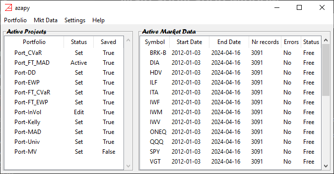

# Main application window #

A normal **azapyGUI** session starts and ends at this level. 
The role of main application window is to keep 
track of active portfolios and market data, and to lunch main analytical  (*e.g.*, 
backtesting, portfolio rebalancing, market data analysis) as well as
basic maintaining procedures (*e.g.*, edit, save, load portfolios and market data, etc.).

It may look like this:

It has 3 distinct elements:
* `Menu` 
* `Active Portfolios` board (left) - keep track of the portfolios present in the **azapyGUI** memory.
* `Active Market Data` board (right) - keep track of the market data loaded by the application.

## Menu ##

The main menu has the following sections,
* `Portfolio`
* `Mkt Data`
* `Settings`
* `Help`

### __Portfolios__ section ###

It has the following items,
* `New` - open a new portfolio `Edit` window. [Here](Portfolio_Edit_Panel.md) are more details.
* `Open` - load an existing portfolio from a *json* file. Multiple selections are allowed.
* `Edit` - open the `Edit` window for an active portfolio (already loaded). [Here](Portfolio_Edit_Panel.md) are more details.
* `Backtest` - launch the backtesting procedure for a single active portfolio with status `Set`. [Here](Backtest_Panel.md) are more details.
* `Rebalance` - launch the rebalance procedure for an active portfolio with status `Set`. [Here](Rebalance_Panel.md) are more details.
* `Save` - save an unsaved (`Saved `value is `False`) active portfolio.
* `Save all` -  save successively all unsaved active portfolios.
* `Remove` - remove an existing active portfolio with status `Set`. 
If the portfolio is unsaved, it will ask if you want to save it.
* `Exit` - shutdown the application: close all windows and ask to save unsaved portfolios.

Note that from the main menu only single-portfolio backtest can be launched. Multiple-portfolio
backtest can be launched from the `Active Portfolio` board (see below explanations).

### __Mkt Data__ section ###

It has the following items,
* `Load` - load historical market data for one or multiple symbols. 
Upon selecting, the `Download Market Data` window will popup. It is described below.
It is not a commonly used feature since both backtesting and rebalancing procedures will
automatically load necessary market data. However, this feature may become handy if we want to 
analyze standalone market data associated with some symbols.
* `Clean` - delete all the files from the `Market Data Directory` location set in the application settings.
Note that `Market Data Directory` serves as a (buffer) location to save all the market data retrieved 
from the provider. For speed reasons, successive calls for the same market data will be satisfied first 
by reding from this location and then, and only if it is a need to update, from the provider. 
`Clean` ensure that this data is deleted, and further buffering starts from scratch. It is not a 
common procedure, but if may be useful as a general refresh.

### __Settings__ section ###

It has a single item, `Application Settings`. It will bring up the `User Default Setting` window described [here](Settings_Panel.md).

### __Help__ sections ###

It has 3 items:
* `Help Index` - Access to general application documentation.
* `Quick Start` - "101" how to use **azapyGUI**. Most useful for a new user.
* `About` - General information about the application (including current version).

## __Active Portfolio__ board ##

It is empty when the application is launched. Any newly edited, loaded, and cloned portfolio will be 
listed here. During a session, the portfolio names must be unique. You cannot create (edit, load, or clone)
a portfolio with the same name as an existing active portfolio. 

An active portfolio has 2 attributes:
* `Status` - indicates the portfolio status. It can take 3 values:
    - `Set` - portfolio is ready to be engaged in computations and any other procedures.
    - `Active` - portfolio is already engaged in computations. Alteration functions (*e.g.*, edit  and remove) cannot be performed.
    - `Edit` - portfolio is under editing procedure. It cannot be involved in any other procedure until it is released. 
    Cloning of the original version of the portfolio, before editing, is still permitted.
* `Save` - indicates if the portfolio is saved:
    - `True` - the present state of the portfolio is already saved,
    - `False` - portfolio is not saved. 

`Fast load` - right clicking the mouse on the column name `Portfolio` will produce the same effect as selecting `Menu`/`Portfolio`/`Load`, but with less clicks.

`Floating Menu` - `right click` the mouse on a portfolio name. The portfolio is selected, and a floating menu is dropped down. It has similar 
items to the main Menu: `Edit`, `Backtest`, `Rebalance`, `Clone`, `Rename`, `Save`, and `Remove`.

`Multiple Selections` - `Shift` + `right click` and `Ctrl` + `right click` the mouse produces multiple selections. `Backtest`,
`Save` and `Remove` act on multiple selections while `Rebalance`, `Edit`, `Close`, and `Rename` will act only on the top selection.

Overall, the `Floating Menu` is faster, in terms of number of clicks, than the main `Menu`. However, the 
most useful feature is the ability to launch a multi-portfolio backtest procedure. 

## __Active Market Data__ board ##

It is empty when the application is launched. It lists the market data symbols that are in the **azapuGUI**
memory. More symbols will be added as more markets data is required by computations or uploaded by the user.

Several descriptive fields are present:
* `Symbol` - is the exchange symbol of the time series.
* `Start Date` - time series start date.
* `End date` - time series end date.
* `Nr records` - total number of business day in the time series.
* `Errors` -  it is `No` if there are no missing data in the time series. 
If there are missing records, then the time series is unusable. **azapyGUI** does not provide any fill back missing data procedures. 
We strongly advise using a different source of market data or avoiding using it altogether.
* `Status` - if it is `Free`, then the time series can be used in computations. It may not be `Free` during brief periods 
when the time series is updated.

`Fast load` - right click the mouse on the column name `Symbol`. It will produce the same effect as `Menu`/`Mkt Data`/`Load`, but with less clicks.

`Floating Menu` - `right click` the mouse for single selection or `Shift` + `right click`, and `Ctrl` + `right click` for multiple selections, and
a floating menu is dropdown. It has 4 items:
* `Update` - update the time series in terms of start/end dates. Note that this is a manual update. The update of the 
time series occurs automatic as needed during computation procedures. As a manual procedure, it has a limited use, but useful for occasional standalone studies of the 
historical market data time series.
* `View` - will launch the `Statistics` window for selected times series. Many reports, graphs, and raw data saving mechanisms are 
provided [there](Statistics_Panel.md).
* `To Excel` - save all selected time series in a *xlsx* file. Each time series is saved in a separate tab sharing the symbol name. Note 
that same feature is available in `Statistics` window. Moreover, if Excel is installed on your computer and in the `Application Settings`/`Miscellaneous`/`Open Excel` box
is checked, then after the file is saved an Excel session is opened containing this file.
* `Remove` - remove the selected symbols for the **azapyGUI** memory.