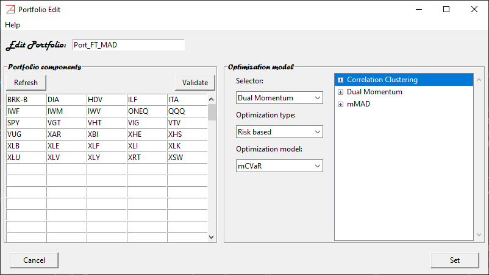
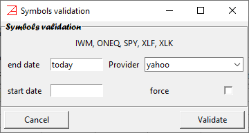

# Portfolio Edit panel #

`Portfolio Edit` window facilitates the editing of new/existing portfolios. It may look like this:

There are 3 main features that describe a portfolio:
* portfolio name
* portfolio components
* optimization model

## Portfolio name ##

It can be entered at the top. The default value (for a new portfolio) is `MyPort`. Feel free to change it
to something meaningful to you. Note that the portfolio name must be unique during an **azapyGUI** session.

## Portfolio components ##

The exchange symbols can be entered on the left panel. It must be one symbol per cell. 
Pressing __Enter__ will move the focus to the next cell. The symbols can be entered in 
any cell, not necessarily in order, using lower or upper characters. Leading and ending spaces 
will be ignored.

### __Refresh__ button ###
At any time, you may press the `Refresh` button. The symbols will be arranged in alphabetical order, uppercase, 
from left to right and up to down. Symbols containing special characters other than alpha-numeric, `-`, `_`, and `^`
will be silently removed. 

### __Validate__ button ###
The symbols can be validated as real exchange symbols by pressing the `Validate` button. 
Doing so, the `Symbol Validation` window will popup. It may look this:

Pressing the `Validate` button will direct
**azapyGUI** to request some data from the market data provider. A symbol will be considered 
valid if the provider fulfils the request. Otherwise, a warning window will popup asking if
you want to keep this name in the symbols list. At this point you can discard the symbol (perhaps it is 
a misspell) or you may keep it and change the market data provider in the `Symbol Validation` window
(if you had registered several market data providers on the [`Market Data Settings`](Settings_Panel.md)).
Note that a portfolio cannot be saved (or made available for further computations) if any of the symbols 
are not valid. Also, the symbol list must hold at list one valid symbol.

#### __Symbol Validation__ window ####
A few remarks about the `Symbol Validation` window, see the fig above. 
At the top are listed the symbol names subject to validation.
In most cases the default values can be accepted as is. Here are their meanings.
* `end date` - time series end date. The default is `today`. It stands for the latest 
exchange business day. 
* `start date` - time series start data. The default is empty; it stands for *start date = end date*.
Alternatively, a valid date smaller or equal to the start date can be entered. For example *start date = 1/1/2012* will
trigger a request for time series starting on the first exchange business day after, and including,
the *start date*. Note that the collected market data will be stored by **azapyGUI** for further 
computations.
* `Provider` - market date provider name (registered with **azapuGUI** on [`Market Data Settings`](Settings_Panel.md)).
* `force` - if the box is checked the request is sent directly to the provider, otherwise the data will be read from the `Market Data Directory`
location if it is available, and then from the provider if is not.

Upon completion, the valid symbols will be listed in the `Active Market Data` panel of the main application window. 

## Optimization model ##
These are the analytical algorithms for portfolio weights evaluations. Some may be very simple; the simplest model is Equal Weighted Portfolio 
where all weights are equal to *1/n* with *n* the number of portfolio weights. Others may be very sophisticated, involving
selectors as well as an optimizer. For example, the model listed in the `Portfolio Edit` fig at the top this section, involves 
2 selectors: Correlation Clustering, and Dual Momentum, as well as optimizer maximizing the Sharpe ratio for a (1,1)-mMAD
risk measure. The analytical models are discussed [here](https://azapygui.readthedocs.io/en/latest/Model_Panels.html). 

Model choices:
* `Selector` - the Selector model can be chosen from the first combobox.
* `Optimization type` - designates the optimizer family.
    - `Risk based` - optimization based on various risk measures.
    - `Naive` - simple optimization inspired by market wisdom. 
    - `Greedy` - maximum return optimization using other criteria than risk exposure (as in risk measures). 
* `Optimizer model` - the actual optimizer model corresponding to the value of the `Optimization type`.

Once a value is chosen for the `Selector` or `Optimization model`, the corresponding model parameters window will
popup. The model parameters windows will be discussed [later](https://azapygui.readthedocs.io/en/latest/Model_Panels.html).

After the model is selected and the parameters are chosen, the models are listed on the right table. 
Pressing on the + will expose the parameters value. A valid model may have several Selectors (or none) and
one and only one Optimizer. Always the Optimizer will be listed last. 

The order of Selectors (if there are more than one) matters. Right clicking the mouse on the 
Selector name will drop down a menu allowing us to move the Selector up or down the list. 
In the example above
the model will execute successively, a correlation clustering selection (eliminating similar assets), followed by a dual momentum 
selection (of best assets and capital at risk allocation), and finally an mMAD-Sharpe weights optimization on the selected 
components. 

## __Set__ button ##
After the model choices are made, the model can be recorded by pressing on the `Set` button.
At this level, the portfolio name is validated (as a unique name), portfolio components symbols are validated (if they 
were not manually validated), check if all model parameters are compatible. Any irregularity will popup as a 
warning window asking for corrections.

__Note that only a valid portfolio (name, components, and models) can be registered with **azapyGUI**.__
