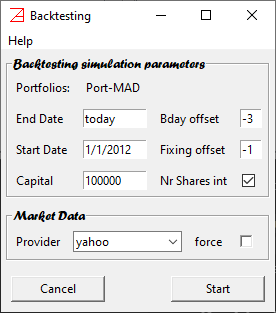
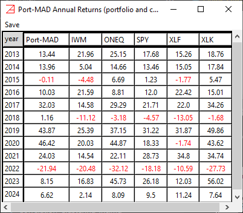
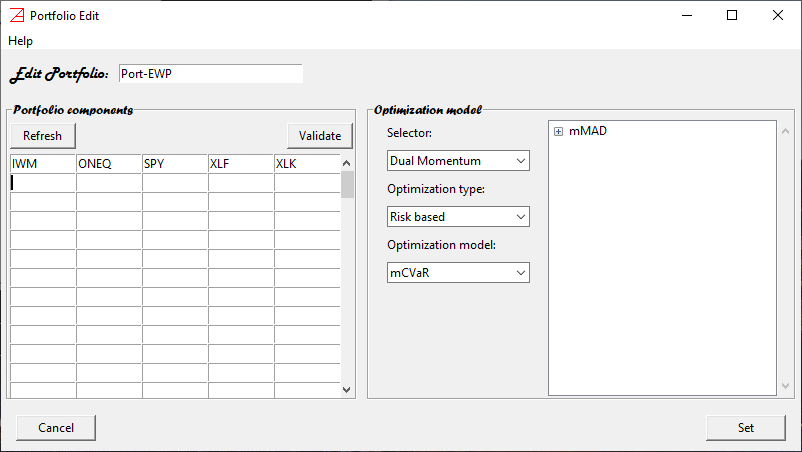
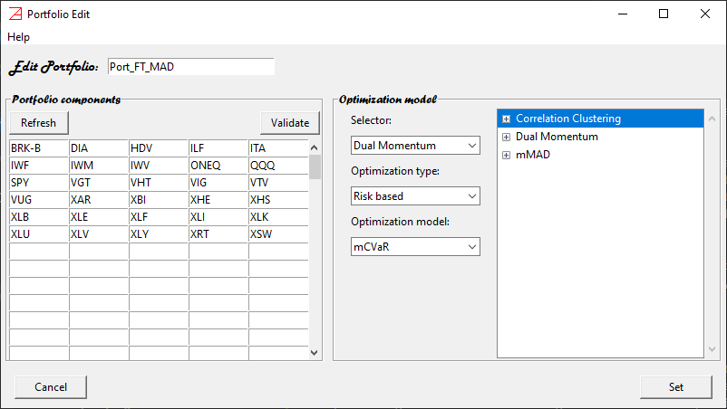

# Quick Start #
## Installation ##

Package installation: *pip install azapyGUI*

## Start ##

To start the application, you need to write the following 2-line python script. 
For this example, let's call it `my_azapy.py`.

```python
import azapyGUI
azapyGUI.start()
```
Then run the script in a powershell as 
```
python my_azapy.py
```
This will bring up the main application panel.


There are no active projects nor active market data for now. We will come back to these in a minute. 
For now, first things first. 

## Basic Setups ##

On the menu, click on `Settings` and then on `Application Settings`. 
The `User Default Settings` window will popup.


In the first tab, called `Directories`, you must make three choices.
1. `Portfolio Directory` - this is the default user directory where you can save/load portfolio/project files. 
When save/load a project, you will be prompted to this 
directory (you can always change it). 
2. `Market Data Directory` - local (buffer) market data directory. Once the historical data is retrieved form 
the provider, a copy is stored in this directory. Successive calls for the same market data will try first to access data from
this directory and then, and only if there is a need to update the data, from the provider. This will speed up considerable 
the computations (in general accessing repeatedly the same provider data over the internet may add up to a 
considerable amount of time). The market data stored in this directory is not intended to be consumed by other 
applications nor as permanent storage. There are other mechanisms provided by `azapyGUI` for visualizing and 
analyzing the market data as well for saving it in a variety of file formats. 
3. `Data Output Directory` - this is the default user directory where graphical and analytical reports can be 
saved for further inspection. 

Then press `Save` and close the window. 

These are persistent setups, preserved between `azapyGUI` sessions.


We will come back later to the topic of user settings with more details about the available options. 
For now, this is all what we need to start the very first `azapyGUI` session.

## Build First Portfolio ##

Now we are back at the main panel, and we will start to build the first portfolio project. 
On the menu, click the tab `Portfolio` and then click on item `New`. 

A `Portfolio Edit` window will popup.


Here we will enter the portfolio information: name, components, and optimization model.
1. Name - on the entry space, right of label `Edit Portfolio`, replace the suggestion `MyPort` with 
    the name you want for this portfolio (try to choose something short and meaningful for you). For
    our example let us type `Port-MAD`. I know, it is not very inspiring or meaningful, but it will
    help us to navigate this example. 
2. Portfolio Components - on the left panel enter the symbols of the portfolio components. 
    For our example let's type SPY, ONEQ, IWM, XLK, and XLF. You must enter one symbol name per cell. 
    It doesn't matter in what order, lower or upper case, or in what specific cell. Then press 
    the `Refresh` button. The symbols will be enumerated in alphabetical order, upper case, from left to right and
    up to down. Also, entries with special characters that cannot be present in a valid
    symbol name will be eliminated silently. This is a good time to check the spelling too. 
    In our case, the 5 symbols belong to 5 very popular ETF's. However, to make sure 
    that they are valid market symbols for our market data provider, let's press on the 
    `Validate` button. A `Symbols Validation` window will popup. 

    

    We will discuss later the 
    optional entries in this window. For now, just notice that the market data provider 
    is `yahoo`. It is our default choice (it is free "as is"). Later, we will discuss 
    how other (pay for) market data providers can be set up. Let's press on the `Validate` 
    button. You will notice two things.
    * It takes a while to release the window. This is the time spent by `azapyGUI` to 
    contact the market data prover (in our case `yahoo`) and to make a minimal request for 1 (most recent) 
    historical record for each of the symbols. In this way it establishes that these
    symbols are valid market shares symbols, and they can be used in defining our portfolio.
    * The right side of application main panel, `Active Market Data` was populated with our symbols
    (although the length of the historical data is only 1 day - hardly enough for any computations). 
3. Optimization Model - although there are many and some of them very complex choice, for this 
    example we will make a simple choices. On the third drop-down list under the label `Optimization Model:` 
    click on `mMAD` (mixture Mean Absolute Deviation). An mMAD edit model parameter window will popup.


We will comment later on the meaning of these parameters. For now, we will accept the default values. 
They stand for maximization of Sharpe ratio with 0 risk free rate and (1,1)-mMAD risk measure, targeting 
quarterly rates of return for a look-back period of 1.25 years, using the `ecos` numerical 
library for LP (linear programming) problems. Let's press on the `Save` button. The model parameter
window will close and our model will appear in the right panel of `Portfolio Edit` window. By pressing 
on + it can be extended to view the value of all parameters. 

At this point we are almost done. What is left is to press on the `Set` button. 
The `Portfolio Edit` window will close and our model will be visible in the left panel of 
main application window. It will have.
- `Status`::`Set` - it means that the portfolio is ready for computations.
- `Save`::`False` - it means that the portfolio is not yet saved.
To save the portfolio, left click the mouse on the portfolio name. From the dropdown menu 
chose `Save` item and proceed to save the portfolio structure to a file in the default directory.

## Backtesting ##

Now we are ready to put our portfolio to the test, *i.e.*, backtest.

Left click the mouse on the portfolio name, and from the dropdown menu choose the `Backtest` item.
The `Backtesting` window will popup. 



We will accept the default values. Later we will discuss in detail all available options. 
However, it is worth mentioning a few features now. The name of our portfolio is at the top
of the screen. In general, `azapyGUI` allows for multiple portfolios backtesting. 
In this case the list of portfolio names will be visible at the top of
the window. End date is set to `today` (*i.e.*, most recent market closing date) and the 
start date is set to `1/1/2012` (*i.e.*, the first market closing date after, and including, 
`1/1/2012`). The rebalancing date is set to 3 business days before (this is the meaning of 
`-3` value for `Bday offset` field) the end of the calendaristic quarter (the quarterly reset 
was defined by the model parameter, *i.e.*, `Q` choice for `freq` value). The fixing date
(*i.e.*, the closing day relative to which the portfolio weights are computed) is defined 
as the closing day before the rebalancing day (*i.e.*, the `-1` value for `Fixing offset` field).
A check of `Nr Shares int` box, stands for using whole numbers (opposed to fractional)
of shares (therefore the portfolio will be subject to rebalancing round off errors - in practice they
are very small).

Let's press the start button. The backtesting process starts collecting the market data. It will take
a bit of time to retrieve the data directly from the provider and a lot faster if it is already 
cached. Then the actual numerical computations will proceed (by default `azapyGUI` will use all CPU cores available). 
The effective user time for these process (market data collection and actual numerical 
evaluations) will be posted at bottom of the window. When all the computations are finished the 
`Statistics` window will popup. 


The plot is our portfolio performance over time, assuming full reinvestment. On the right side 
panel there are many graphical and analytical options (numerical reports). They will be discussed later. 
For now, let us look at the `Specific` section (*i.e.*, portfolio specific analytic reports) and
from the second dropdown entry click on `Annual` (*i.e.*, the annual returns report). 
The `Annual Report` window will popup.



The portfolio and its components' annual returns (percent) are presented. The negative returns are printed in red.
Note that, pressing the `year` heading cell, the results will be printed in descendent order of years.
To save this report, press on the menu `save` and choose the format. You will be
prompted to save the report in the default location (defined in Setting `Data Output Directory`).

We will stop this presentation here, hoping that you have got a general idea about `azapyGUI` backtesting capabilities. 
Later, we will explore the full set of analytic reports.

## Rebalancing ##

Another important `azapyGUI` functionality is the computation of weights and the size of buy/sale orders 
to rebalance an existing portfolio. 

Let's imagine that we are after today closing and tomorrow we would like to initiate a position in
`Port-MAD`. We will need to compute the weights and the number of shares that we need to buy. 
To initiate these computations, let's go back to the main panel, right click the mouse on the portfolio 
name, and select `Rebalance` item. The `Rebalance` window will popup.


In the left panel are the components of our capital. Since this is a new position on this portfolio, we will
start with a cash amount of money and zero shares. By default, in the `Cash` entry, it is printed 100000 (dollars). 
You can change this value to an actual amount of dollars you want to allocate to this investment. 
Then, if you press the `Weights` button, `azapyGUI` will return a report showing the value of the weights 
for each portfolio component. This is useful information to understand capital allocation. 
Further, if we press on the `Treading Sheet` button, the transactions report will popup. 
Here are listed the initial, final, and delta (final-initial) positions for all assets with non-zero allocations. 
This report can be saved and used next day (rebalancing day) to assist the execute of the 
actual transactions.

The similar computation for an existing portfolio requires to enter the initial (existing) number of 
shares for each portfolio component and a non-zero value for `Cash` only if we want to increase the 
capital (a positive amount) or reduce the capital (a negative value) for this strategy. Then, the `Treading Sheet` will
show the right number of shares (delta positions) that will rebalance the portfolio. 

## Backtesting Multiple Portfolios ##

Another aspect of **azapyGUI** backtesting facility is the ability to handle multiple portfolios. 
It provides an easy way to compare several portfolio strategies. Although there are no limitations (besides hardware 
limitation in terms of memory and computational speed) in how many portfolios can be backtested at once, we 
fund that more than 20 in a single batch become hard to follow. Running multiple batches and sequentially eliminating 
the wicker candidates, is a more reliable selection strategy.

To illustrate this facility, in this example we will use only 2 portfolios. Let's start by cloning our previous 
`Port-MAD` portfolio. On the main application window left click the mouse on the portfolio name and select the
`Clone` items. A portfolio clone window will popup.


It is asking us to choose a name for the new portfolio. Let's go ahead and type `Port-EWP` (soon will become 
clear why we chose this name). Then press `OK`. 
A new entry will appear in the `Active Projects` section of the main application panel. At this point we have 2 
identical portfolios with different names. Let us edit `Port-EWP`. Left click the mouse on the portfolio name and
select the `Edit` item. The portfolio edit window will popup. It will look as



It is the same as for `Port-MAD` except the name is now `Port-EWP`. We would like to keep the same 
portfolio components and change the optimizer model. To do that let's first remove the present optimization model `mMAD`.
We can have only __one__ optimizer associate with a given portfolio. To do that, on the right panel, `Optimization model`,
left click the mouse on the model's name and choose `Delete` item. The model's name will disappear. Now it is time
to choose another optimizer. Left click the mouse on the second combobox under the label `Optimization type` and 
choose `Naive` item. This will select the family of optimization models. Then, in the combobox below 
left click the mouse and choose the `Equal Weighted` item. The Equal Weighted model parameters window will popup


This is the simplest portfolio model, the Equal Weighted Portfolio (hence the name of our portfolio, `Port-EWP`). As the 
name suggests, the portfolio weights are periodically rebalanced to be the same for all components. The only 
parameter we need to choose is the rebalancing frequency. Let's keep the default value `Q`, it stands for quarterly 
rebalance, and press the `OK` button. Now the Equal Weighted model is associated with our portfolio `Port-EWP`.
As a side note, we should mention that the EWP, although very simple, is a popular benchmark portfolio often 
used to evaluate the goodness of a more sophisticated optimization scheme. Let's go ahead and press the `Set` 
button. Even if we didn't ask explicitly to validate the components symbols, **azapyGUI** will validate them 
with the market data provider. If the market data is not already cached, then this procedure may take a bit of time.
Finally, we have 2 distinct portfolios waiting for us. If everything went well, the main application window 
should look like this.


Now press `Shift + left click the mouse` select both portfolio and from the popup menu click on `Backtest` item.
Note that pressing `Ctrl + left click the mouse` will produce the same result in our case. In general pressing `Shift`
will force a selection of consecutive items while `Ctrl` will limit the selection only to the item 
pointed by the mouse. Again the `Backtesting` window will popup with both portfolio names listed at the top.
We choose the default settings and press directly the `Start` button. The backtesting procedure will start 
by collecting the market data (for all portfolios) and then computing each portfolio independently. At the end
of computations the `Backtesting` window will look like


You can notice the time spent (by my computer - an average configuration) collecting the market data
and computing each portfolio. Also, a new `Statistics` window will popup. 


It is like the one before (for a single portfolio) but with a few more features. 
On the right side there is a new box called `Reference`. Since the time series for `Port-MAD` and 
`Port-EWP` have different lengths, the `Reference` combobox indicates the time series used as 
reference for the graphical presentation. The default choice is the longest time series. In our 
case `Port-EWP`. However, if you want to change the reference time series, just click on the 
desired one. 

Note that, EWP model doesn't need special calibration; all weights are 
equal to *1/n* where *n* is the number of portfolio components. Therefore, the backtesting period
starts immediately (at the first rebalancing date). For `Port-MAD` the backtesting period can start 
only after 1.25 years reserved for first calibration of portfolio weights (this value was set as a model parameter).
Hence the uneven length of two series in our example.

All other features are the same. The `Report` box refers to comparative reports between the two portfolios, 
while the `Specific` box to portfolio specific reports. Every report, as well as the graph, can be saved as usual.

## Example of a complex portfolio ##

To further illustrate the power of **azapyGUI**, let's 
discuss an example of more complex portfolios, involving multiples selectors as well as an optimization model.
The selectors will be presented in detail later. For now, we should keep in mind that they are 
analytical algorithms to restrict a given universe of a possible portfolio components to a smaller, eventually significant, 
number of candidates. While a selector may also put restrictions on the overall capital size, it will
not define the portfolio weights. That job is reserved for the optimization model. In general, a portfolio 
model may be a collection of selectors followed by an optimizer. The order of selectors matters. 

Without further due, let's start to define our portfolio. From the menu choose the `New` item, to open the 
`Edit` window. Let's name this portfolio `Port-FT_MAD`, and for components, let's enter: 
BRK-B, DIA, HDV, ILV, ITA, 
IWF, IWM, IWV, ONEQ, QQQ, 
SPY, VGT, VHT, VIG, VTV, 
VUG, XAR, XBI, XHE, XHS, 
XLB, XLE, XLF, XLI, XLK,
XLU, XLV, XLY, XRT, and XSW.
In total there are 30 symbols. All are popular ETF's, except BRK-B which is not an ETF. 
However, BRK-B behaves as a closed-end found, so it is OK to be in this list 
(I hope, I didn't offend anybody's feelings about BRK-B). On the `Optimization model` section let's choose, from the top combobox, 2 selectors:
`Correlation Clustering` and `Dual Momentum`. In both cases we accept the default parameter values. Latter we will discuss more the analytics behind 
these selectors and how they behave. For now, let's keep in mind:
* `Correlation Clustering` will partition the universe of portfolio components in clusters with similar correlation (in our case higher than 0.98 - the default value). Then,
from each cluster, it will choose, as a representative, the element with the higher weighted average of annualized, 1, 3, 6, and 12 months most 
recent rate of returns (also called `f13612` filter).
* `Dual Momentum` will choose a maximum *n* components with positive `f13612` filter value. The capital allocated to the risky assets (non-cash) is in full only 
if the total number of components with positive `f13612` filter value is equal or greater than the threshold value *m*. Otherwise, the risky capital allocation 
will decrease proportionally, with the remainder reserved in cash (until the next portfolio rebalancing date). In our case *n=3* and *m=6* (the default values).

For optimizer model let's choose as before the mMAD model with default parameters. The `Edit` window should look like this:



Note the order of the models. The optimizer is always the last (it is a hardcoded feature). The first selector is the `Correlation Clustering`. 
Strictly from a math point of view, it can also be in the second position. However, logically we want first to eliminate assets with similar correlations 
and then to choose by the best momentum value. So, we strongly prefer `Correlation Clustering` to be the first and `Dual Momentum`
to be the second. If they are not in this order them left click the mouse in the selector name and choose to move it up or down as is the case. 

Ok, let's press on the `Set` button. If the components were not validated before then the validation is mandated in the background (so it may take a bit 
of time to set the portfolio). 

By now, we have put a lot of work into defining this portfolio. So, let's go ahead and save it before doing anything else. 

Just to add a bit of spice to our example, let's clone this portfolio to `Port-FT_EWP`, and as before, let's change the optimizer 
of the newly cloned portfolio to `Equal Weighted`. Now we have 2 complex portfolios differentiated by the optimizer. 

Select both portfolios and run the backtest. This is what I get running this example after the close on April 12th, 2024:


You can repeat these examples (finally using your choices for portfolio names)
using different parameter values (e.g. `f13612` filter weights, n=6 and m=12 for `Dual Momentum` thresholds, other optimizer models, etc.).
