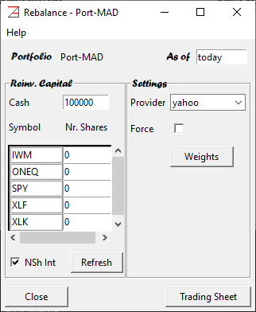

# Rebalance window #

This is the main facility to compute the rebalancing weights and positions for a given portfolio.

The portfolio name is printed at the top left of the window. At the top right is the "As of" date. 
Its default value, in our case `today`, is the value set in [`Application Settings/Miscellaneous/edate default value`](./Settings_Panel.md#miscellaneous). 
The "As of" date is rollback automatically to the latest market close date. In most cases, the value `today` is the preferred choice to evaluate the weights and number of shares of a portfolio that we want to invest in tomorrow. 

There are two main panels.

## Reinvested Capital ##

Here we enter the cash and the number of existing shares that form the bases of the reinvested capital. 

The `Cash` default value, in our case 100000, is the value set in [`Application Settings/Miscellaneous/Capital default value`](./Settings_Panel.md#miscellaneous).
The currency is understood to be the exchange currency (where the exchange is implicitly defined by the exchange calendar set in 
[`Application Settings/Miscellaneous/Exchange calendar`](./Settings_Panel.md#miscellaneous)).

By default, the existing portfolio components numbers of shares of are set to 0. If we deal with an existing portfolio and we are looking to compute 
the new rebalanced positions (to invest in tomorrow) then these values need to be overwritten with the actual exiting positions. In this way the 
delta number of shares (the actual buy/sale number of shares) will be computed correctly in the `Trading Sheet` report.

In general, if we initiate a new portfolio the `Reinv. Capital` should have a non-zero `Cash` value reflecting the amount of cash that we are
investing in this strategy, and 0 values for the portfolio components number of shares (unless we already have shares invested in these assets 
from different transactions and we are looking to reuse all or a part of them as capital for the new portfolio strategy).

If we already have a position in this portfolio strategy, and we are looking only to rebalance the portfolio, then the value of the 
`Cash` capital could be 0 (rebalancing without additional cash from dividends or rollover cash), a positive value if we add cash capital, or a negative 
value if we reduce the total investment capital. 

`NSh Int`: - if checked the number of shares will be rounded to integer numbers (the most common setup).
Its default value, in our case checked, is the value set in [`Application Settings/Miscellaneous/Int. nr. shares`](./Settings_Panel.md#miscellaneous). 

The `Refresh` button will set all fields to their default values.

## Settings ##

`Provider`: - sets the preferred market data provider. The dropdown values were set in [`Application Settings/Market Data/Market data provider`](./Settings_Panel.md#market-data).
we need to pick one value. In our example it is `yahoo`.

`Force`: - checkbox indicates the mode in which the market data is collected. If checked, the market data will be collected directly from the market data provider.
If left unchecked, the application will use first the locally stored data, if it exists (from a previous similar request),
and then, and only if it is need it, it will access the internet market data provider. It is a faster solution. 
Its default value, in our case unchecked, is the value set in [`Application Settings/Market Data/force`](./Settings_Panel.md#market-data).

The `Weights` button will trigger the weights computation. These are the portfolio weights computed `As of` date.

## Trading Sheet ##

The `Trading Sheet` button triggers the portfolio weights and number of shares computations. The results are presented in the `Trading Sheet` report. 
The report lists only the cash and portfolio components with buy/sale activities. 
Here is the meaning of the report columns.
- `Initial`: are the initial values of cash and number of shares listed in the `Reinv. Capital` panel. 
- `Final`: are the rebalanced cash and portfolio positions (in number of shares).
- `Delta`: is the `Final` - `Initial`. A negative value indicates a sale while a positive value indicates a buy order. In the `Cash` row is the 
total portfolio value (including residual cash due to roundups) as of the closing of `As of` date. 
- `Weights`: are the portfolio allocation weights.
- `Prices`: are the value of the shares as of `As of` date.
- `Allocation`: is the cash equivalent allocation at the shares price indicated in the column `Prices`.

For convenience, the report can be saved in a `csv` or `xlsm` format.

Note: It is expected that the actual rebalancing transactions to be executed near the end of the next exchange business day session. The 
actual execution prices may be different than the prices printed in the report. It is the user's responsibility to bring, when it is the case, additional 
cash to complete the transactions. It is expected to be a small amount.
In the case when is not possible to add in short notice additional cash to the trading account (for example IRA and 401K accounts, or
any other type of account with special transaction rules) the user should reduce the buy orders accordingly. As a rule of tomb, to avoid possible margin account 
fees, one should execute first the selling and then the buying transactions. 

It is a good practice to keep track of the residual cash, originated 
by the roundup to an integer of the number of shares as well as to the price differential between the fixing date (last closing date contributing to the 
portfolio weights computation - in our context `As of` date) and rebalancing date (the date when the actual buy/sale transactions occur).
This value (positive or negative) can be added (along with the cash dividends collected during the rebalancing period) to the `Cash` value for the next rebalancing. 