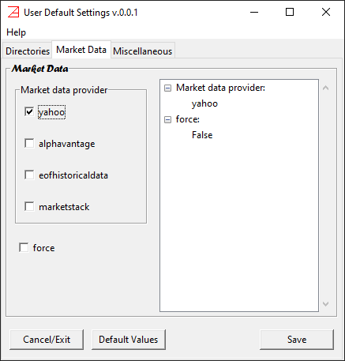
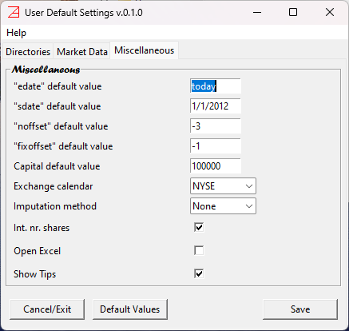

# Settings panel #

Note that the version of the configuration settings is listed in the title of the window. 
In our case, it is v 0.0.1. To not be confused with `azapyGUI` release version (that can be found in `Help`/`About`).
The version of the configuration setting will be incremented only if we add/subtract features to the
settings. 

__All these settings are persistent between `azapyGUI` sessions.__

The `Settings` window has 3 pages:
* `Directories`
* `Market Data`
* `Miscellaneous` 

Let's discuss them one by one.

## __Directories__ page ## 

There are 3 directories that must be set

### Portfolios Directories ###
This is the default user directory where you can save/load portfolio/project files. 
When save/load a project, you will be prompted by default to this directory. 
You can always change the final location to save the project.

### Market Data Directory ###
It is a local (buffer) market data directory. Once the historical data is retrieved form 
the provider, a copy is stored in this directory. Successive calls for the same market data will try first to access data from
this directory and then, and only if there is a need to update the data, from the provider. This will speed up considerable 
the computations (in general accessing repeatedly the same provider data over the internet may add up to a 
considerable amount of time). The market data stored in this directory is not intended to be consumed by other 
applications nor as permanent storage. There are other mechanisms provided by `azapyGUI` for visualizing and 
analyzing the market data as well for saving it in a variety of file formats.

The directory can be empty from the menu of main application window, `Mkt Data`/`Clear`. You should do this only if you have 
suspicions that the market data may contain erroneous values or was amended by the provider.

### Data Output Directory ###
This is the default user directory where graphical and analytical reports can be 
saved for further inspection. 

At the time of saving to file, you will be prompted by default to this directory.
You can always change the final location.

## __Market Data__ page ##

Here you can set the market data providers.

On the `Market data provider` box you can choose the prefer providers. 
Supported are,
* [`yahoo`](https://finance.yahoo.com/) - free "as is".
* [`alphavantage`](https://www.alphavantage.co/) - pay for. You need a valid user key.
* [`eofhistoricaldata`](https://eodhd.com/) - pay for. You need a valid user key.
* [`marketstack`](https://marketstack.com/) - pay for. You need a valid user key.
In the future, this list may be extended. Please [contact us](https://pypi.org/project/azapyGUI/) if you have any suggestions.

When you select a "pay-for" provider a window will popup asking for the provider key and where is the case additional information about the user level
(*e.g.*, for `alphavantage` you need to specify the maximum number of requests per minute - it is specific to your account level). If the provider key 
is left empty then, `azapyGUI` will try to get the key from the user Environment Variables. They are respectively:
* `ALPHAVANTAGE_API_KEY` 
* `EODHISTORICALDATA_API_KEY`
* `MARKETSTACK_API_KEY`

Since the keys are long alpha-numeric strings, we strongly recommend to setup the corresponding environment variable holding the value of the key.
Alternatively, they can be entered explicitly in the `azapyGUI` configuration window.

You can choose more than one provider. However, during computations, when you are asked to specify a market data provider, you will be prompted to make a choice form 
the list of default providers set in the configuration. 

Another option in this page is the default value for logical flag `force`. Its value can be changed at the time when 
a market data request is made. A checked value will ask `azapyGUI` to retrieve data directly from the provider, bypassing the local buffer
(set in the `Market Data Directory`). This will guarantee the quality of the market data as intended by the provider. However, it will 
slowdown the overall execution time. In general, accessing repeatedly large amounts of data over the internet may be time consuming. Moreover,
some providers (check the user agreement with them) may restrict (or charge additionally) for excessive data requests. 

We strongly recommend leaving unchecked this flag (as a default value).

## Miscellaneous page ##

This is a collection of default values for certain common entry fields in various application windows.

* `edate` - end date (most recent date) for a time series. Default value `today` stands for most recent market closing date. 
It could be the actual today date if today is a working day for the exchange and we are after the closing time.
* `sdate` - start date for a time series. This is a default value, understood as the first market closing date after, and including, this date. 
Our suggestion is 1/1/2012.
* `noffset` - number of offset business days defining the rebalancing date. The offset is relative to the calendar end of rebalancing frequency. 
For example, if the rebalancing period in `Q` (quarterly) then the offset is relative to the last business day of Q1, Q2, etc. 
A value of `0` means the last business day of the quarter. Our suggestion is '-3', three business days before the quarter end. `noffset` may 
take positive values. In this case a value of `3` means 3 business days after the quarter end. 
* `fixoffset` - number of offset business days defining the fixing date. Fixing date defines the most recent closing prices that can be included
in the portfolio weights calibration. `fixoffset` is relative to the rebalancing date. It can take only non-positive values. A value of `0` means 
that the fixing date is the same as the rebalancing date. It assumes that the portfolio weights computations and market order for the shares can be done in 
the last few seconds before the market closes. For most of the retail users it is likely impossible. Our suggested value is `-1`. It implies that
the fixing date is the closing day before the rebalancing date and the portfolio weights are computed relative to this closing (*e.g.*, if
the rebalancing day is a Monday then the fixing date is the previous exchange business day; it could be a Friday).
* `Capital` - default cash value of the capital. Our suggestion is $100,000.
* `Exchange calendar` - exchange business calendar (ISO) name, [see the list of valid calendars names](./Calendars.md). It is the user responsibility to set 
the exchange calendar relevant to the underlying portfolio symbols. The prevalent currency is the exchange currency (designated by the calendar). 
You may adjust accordingly the `Capital` default value. For example the currency for London exchange is penny not pounds.
If the calendar is changed during a session (an unusual operation), then all the loaded market data is removed. 
* `Imputation method` - specifies how to replace the missing data. Possible values, `None` - no imputation, and `linear` - liner interpolation.
* `Int nr. shares` - logical flag. If checked the number of shares (for rebalancing) are rounded to integer numbers. Most of the brokers 
requires orders of integer number of shares. There are a few brokers that allowed for fractional number of shares. Before using them
check the fee’s structure. It may be against you. Choosing an integer number of shares may introduce rebalancing roundup errors.
These are capital compensations - the user is assumed to add or retain some cash during a rebalancing period equivalent to the aggregated 
fractional number of shares. In general, this is a very small quantity with no practical impact. Our suggestion is to have this flag checked.
* `Open Excel` - you can check this flag if you have Excel installed on your computer. If so, after saving a file in `xlsx` format, an Excel session 
containing this file will be automatically open.
* `Show Tips` - logical flag. Many of the entry fields are raising a brief message, a tip, when the mouse hovers over them. It is a
very useful feature, especially at the beginning. However, if you uncheck this flag, these tips will be suppressed.

For a beginner, our suggestion is to accept the default values for these fields (may be `Open Excel` can be changed if you have Excel installed in 
your computer). Later you can decide how to change them reflecting your preferences.
