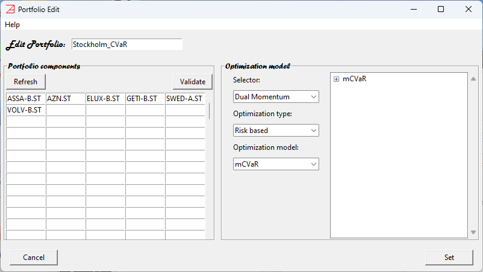

# Trading on non-US markets #

While most examples use US products (NYSE symbols - default setup), `azapyGUI` provides support for non-US exchange products. 

To access (equity) products from a non-US exchange, first we need to set up the corresponding business calendar.
In `Settings/Application Settings/Miscellaneous` set the `Exchange calendar` to corresponding ISO code and press `Save` button. 
Note that this is a persistent setting, and so it needs to be done only once.

For example, if you are in Sweden and
want to trade symbols from Stockholm exchange, then you need to set the `Exchange calendar` to `XSTO`. 
The list of supported exchange calendars is [here](./Calendars.md).
General information about application settings can 
be find [here](./Settings_Panel.md).

Once the `Exchange calendar` was set, the rest of the application works as usual. 

Here is an example of a portfolio with symbols traded on Stockholm exchange. 

We have used `yahoo` as market data provider; therefore, all the symbols have the suffix `.SL`. 
Any cash value is understood to be denominated in the Exchange currency. In our Stockholm example
the currency is Sweden Krona. You may also want to adjust the default value of the `Capital` in the `Application Settings`. 

Note that in some peculiar cases, the Exchange Currency may be different than the Country Currency.
For example, the London Exchange currency for equity is penny and not the British Pound (there are 100 pennies, or pence, to the pound).

$\bf Limitations$.

- Mixed portfolios, with symbols from different exchanges denominated in different currencies, are not supported.
- Comparisons between portfolios defined on different exchanges (currencies and business calendars) are not supported.
- Changing the `Exchange calendar` during a session will reset the market data collection.
- It is the user's responsibility to use the appropriate symbols for the chosen exchange (implicitly defined by the exchange calendar).

